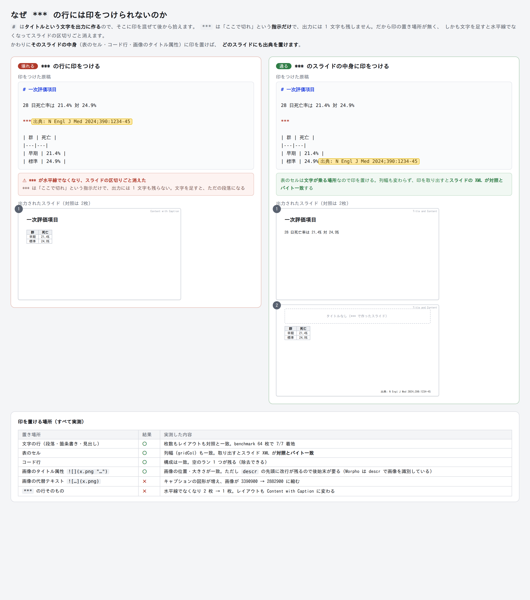

# フッター（出典・注釈）— 設計と検証

抄読会のスライドに「N Engl J Med 2024;390:1234-45」のような出典を小さく載せる。
デッキ全体で同じ出典を出す場合と、スライドごとに違う注釈を出す場合の両方を扱う。

**0.16.0 でデッキ全体のフッターを実装した**（下記「実装計画」の 0.16.0）。
**スライドごとのフッター（`///` と `::: footer`）は 0.17.0 の設計まで済み・未実装**
（「スライドごとのフッター」の節。実装仕様は「多視点監査と仕様の改訂（0.17.0 v2）」が正）。
ここに書いた数値はすべて pandoc-wasm 1.1.0（pandoc 3.10 相当）の
実出力から取った。再現には `app/` で `node scripts/dump-footer.mjs`（デッキ全体）・
`node scripts/dump-footer-slides.mjs`（スライドごと）・
`node scripts/dump-footer-notation.mjs`（記法の選定）を使う。
実機（PowerPoint / Word / iPad）で見たものは一つも無い — 「未検証」の節に列挙した。

---

## 決定事項

| 論点 | 決定 | 根拠 |
|---|---|---|
| 文言の住処 | **content.md**（front matter の `footer:` と `::: footer`） | 出典は装飾ではなく原稿の事実。Obsidian へ持ち出しても残る必要がある |
| 体裁の住処 | **テーマ層**（当面は文書ごとの設定。将来テーマファイルへ引っ越す） | 記法だけでは絶対に小さくならない。pptx では本文段落と 1 バイトも変わらない XML になる（実測） |
| 記法 | **`/// 出典: …`（1 行）** ＋ `::: footer`（フェンスド div・可搬形）＋ front matter `footer:` | 行頭キーワード（`出典:` / `※`）は一般文で誤爆する（実測）。キーワードを記号の内側に閉じ込めれば踏まない。1 行形は閉じ忘れが起こせない |
| pptx への出し方 | **明示 xfrm のテキストボックスを OOXML 後処理で注入** | ftr プレースホルダは継承フォールバックの罠・idx 不定・既定が中央揃え 9pt / 幅 228pt（後述） |
| 帯の座標 | テンプレートの ftr 帯の y/h を借り、幅だけ全幅へ広げる。ftr が無ければ比率の既定値 | テンプレート追従と、データを形式非依存に保つことの両立 |
| スライドの宛先 | **目印（sentinel）方式**。pandoc が実際に置いた場所を読む | `contentIndex + titleOffset` は普通の原稿で壊れる。benchmark で JS 9 枚 対 実 64 枚（実測） |
| 表紙 | **既定で出さない**（オプションで出せる） | 表紙の日付（dt）とまったく同じ帯にいる。表紙の有無自体が metadata 4 キーのどれかで変わる |
| docx | デッキ全体はページフッター、個別注釈は小さい段落 | docx には footer の受け皿が最初から無い（パートもスタイルも 0 個） |
| Web | `</head>` 直前への CSS 注入。デッキ全体は末尾に 1 回 | 既定 CSS に `.footer` 規則が無いので衝突しない |
| プレビュー | 文言は実出力から、体裁はテーマから（既存の二系統合成と同じ） | `parseRuns` は `sz` を読まない。zip を作り直すと +23ms |
| 診断（lint）の出し方 | **`pandoc.log.warn`**。`io.stderr` は使わない | Lua の stderr はホストのコンソールへ出るだけで `res.stderr` に届かない（実測） |
| `***`（hr）領域 | **常に直前の見出しへ巻き上げる。** 誤配置になるので診断を出す | 「その場に残す」「hr 直後へ移す」はデッキ構成を壊すが、巻き上げは壊さない（実測） |
| 1 枚に複数あるとき | **書いた順に連結**（既定の区切りは ` / `） | 目印から順序どおり全部取れる。「最後の 1 つ」はデータロス |
| 空の `::: footer` | **そのスライドだけデッキ既定を抑止** | 空でもデッキ構成は変わらない（実測）ので安全に意味を与えられる |
| 最初の版の範囲 | **front matter のデッキ全体フッターだけ** | Lua ゼロ・目印ゼロ・番号の対応付けゼロ。主用途の大半をここで満たせて、最も壊れにくい |

---

## 実測で確定した事実

### 1. pptx には空のフッター枠が最初から用意されている

pandoc 既定 reference の `slideMaster1.xml`:

| プレースホルダ | 位置（EMU） | 大きさ | 書式 |
|---|---|---|---|
| `dt`（日付） | 457200, 4767263 | 168.0 × 21.6 pt | sz=900 algn=l anchor=ctr |
| `ftr`（フッター） | 3124200, 4767263 | 228.0 × 21.6 pt | sz=900 **algn=ctr** anchor=ctr |
| `sldNum`（ページ番号） | 6553200, 4767263 | 168.0 × 21.6 pt | sz=900 algn=r anchor=ctr |

3 つとも同じ帯（y = 92.69%、高さ 5.32%、スライド下端まで 8.1pt）に横並び。色は `schemeClr tx1` の tint 75%。

- **11 レイアウトすべてが ftr / dt / sldNum を持つが、座標を持つものは 0 枚。**
  レイアウト側は空の `<p:spPr/>` で、継承は必ずマスターへ落ちる
- **pandoc が出力する slideN.xml には ftr の `<p:sp>` が 1 枚も無い。**
  枠はあるが中身は空 — フッターは変換のたびに注入する
- `<p:hf>` 要素はマスターにもレイアウトにも無い

#### それでも ftr プレースホルダは使わない

`<p:ph type="ftr" idx="11"/>` を注入する経路は動く（スキーマ検証 0 件、`parsePptx` が
マスターから frame を継承解決するところまで実測）。使わない理由は 4 つで、いずれも実測:

1. **ftr を持たないテンプレートで本文全面に化ける。** `findInherited` は
   type 一致 → idx 一致 → **body** の順に落ちるので、座標なしの ftr 図形が
   本文プレースホルダの枠（8229600 × 3394472）を継承する。警告はゼロ
2. **idx は正規化されない。** テンプレートの ftr が idx=4 なら出力も idx=4 のまま通る。
   11 決め打ちは書けない
3. **既定が中央揃え 9pt・幅 228pt。** 日本の抄読会の出典は右下か左下が普通で、
   111 字の出典は内寸 213.6 × 14.4pt（autofit 指定なし・9pt で 1 行）に構造的に入らない
4. **`<p:hf ftr="0"/>` を持つテンプレートを警告なしに受け入れる**（reference-doc を素通りする）

代わりに、テンプレートの ftr 帯を「その原稿がフッターを置きたい場所」の宣言として**読む**。
座標は借りるが、注入するのは自前 xfrm を持つ普通のテキストボックスにする。
ftr が無いテンプレートでは比率の既定値へ落ちる。

### 2. 記法は 3 形式すべてで内容を失わないが、見た目は一切付かない

`::: footer` を含む原稿を 3 形式へ変換した実出力:

| 形式 | 結果 |
|---|---|
| pptx | 本文プレースホルダに追加の `<a:p>` として入る。**pPr も rPr も本文段落と完全に同一**。クラス名は出力に残らない |
| docx | `w:pStyle=BodyText`。本文と見分けがつかない。`word/footer*.xml` は **0 個** |
| html | `<div class="footer">` としてクラスがそのまま残る。既定 CSS（3595 bytes）に `.footer` 規則は無い |

つまり**記法の層だけでは「小さく書く」は原理的に満たせない**。体裁は必ず変換層が付ける。
これが「文言は内容・体裁はテーマ」という二層構成が設計上の選択肢ではなく必須である理由。

検討して捨てた記法:

- **見出し属性 `# 見出し {footer="…"}`** — pptx でも docx でも**無警告で消える**（html だけ `data-footer` に残る）。
  データロスなので主記法にはできない。Lua からは読めるので、将来アンカーとしてなら使える
- **front matter だけ** — `metadata.footer` は pptx / docx で `docProps/custom.xml` にしか落ちない。
  「どこにも見えないが消えてもいない」という気づきにくい状態になる
- **bracketed span `[…]{.footer}`** — 同等に安全だが、段落を丸ごと注釈にする用途には div が自然

日本語のクラス名（`::: 出典`）も通り、Lua の `classes:includes('出典')` で一致する。エイリアスにできる。

### 3. スライドの宛先は数えてはいけない

`contentIndex + titleOffset`（装飾が使っている対応付け）をフッターに流用すると壊れる。

- **`fixtures/pptx-benchmark.md`: `cursorSlide.ts` は 9 枚と数え、pandoc は 64 枚出す。**
  主因は表の分割ではなく **pandoc の slide level 自動判定** — `#` の直下に `##` を置くと
  slide level が 2 になり `##` がスライドを作る。抄読会の原稿はまさにこの形
- 15 行程度の典型的な抄読会原稿（front matter + `# 背景` の下に `## 疫学` `## 治療`）でも
  pandoc 6 枚 対 `slideSegments` 2 で一致しない

**目印（sentinel）方式**が答えになる。Lua で footer div を私用領域文字（U+E001 / U+E002）で
挟んだ文字列に置き換え、OOXML 後処理で slideN.xml を走査して見つける。

- U+E000 系の私用領域文字は pptx の `<a:t>`・docx の `<w:t>`・html に**生バイトのまま残る**。
  数値文字参照へのエスケープも欠落も起きない
- ただし**目印を本文の Para として置くのは駄目**。benchmark で 7 件中 3 件が隣のスライドへずれ、
  さらにデッキが 64 → 65 枚に増えた（落とし穴 5 の巻き添え）
- **目印を直前の見出しの inline 末尾へ巻き上げる**と、benchmark で 7/7 正解し、
  **スライド数もレイアウト内訳も 1 バイトも変わらない**（`{"Title Slide":1,"Section Header":7,"Title and Content":53,"Two Content":2,"Content with Caption":1}` が完全一致）。
  除去後は PUA 残留ゼロ・スキーマ検証 0 件
- 巻き上げ先は slide level 以下の見出しに限ること。`###` へ巻き上げると本文に落ちる
- 巻き上げた目印は**タイトルと同じ `<a:t>` に融合する**。除去はラン単位ではなく部分文字列で、
  1 スライドに複数あり得るのでループで行う

### 4. デッキ全体フッターは pandoc を一切通さずに済む

全 slideN.xml へテキストボックスを注入するだけ。番号の対応付けもフィルタも要らない。
`scripts/dump-footer.mjs` の実測:

```
帯の出どころ: テンプレートの ftr 帯
帯: x=457200 y=4767263 w=8229600 h=273844  (y=92.69% h=5.32% 幅 648.0pt)
スライド 6 枚 → 注入 5 枚（表紙は除外）
注入後のスライド数: 6  変化なし: true
@ooxml-tools/validate: 素の pandoc 出力 0 件 / フッター注入後 0 件 / 較正（子要素順を壊した版）1 件
```

benchmark（64 枚）でも 63 枚へ注入して検証 0 件。
表紙の判定は**レイアウト名ではなく `ctrTitle` プレースホルダの有無**で行う
（レイアウト名は配線盤の `applyAssignments` が書き換えるため）。

### 5. docx にはフッターの受け皿が無い

pptx とは事情が正反対だった。

- `word/footer*.xml` も `header*.xml` も**存在しない**。`w:sectPr` は文末に 1 個だけで、
  中身は `w:footnotePr` のみ（`w:footerReference` も `w:pgSz` も無い）
- 既定 reference.docx に `Footer` / `Header` スタイルは**無い**
- 本文（12pt）より小さい段落スタイルは `Abstract` / `AbstractTitle`（10pt）の **2 つだけ**。
  `FootnoteText` も `Caption` も `SourceCode` も sz 指定が無く 12pt を継承する
- したがって `::: {custom-style="X"}` だけでは**必ず本文と同じ 12pt になる**
  （照合に外れた custom-style は `basedOn=BodyText`・サイズ指定なしで自動生成される）
- **custom-style の照合キーは styleId ではなく表示名 `<w:name>`**（大文字小文字は無視）。
  styleId で書くと同じ styleId の 2 つ目の `w:style` が生成される
- reference-doc に仕込んだ `word/footer1.xml` は rels・`[Content_Types]`・`sectPr` の
  `footerReference` ごと**バイト一致で出力へ運ばれる**
- `RawBlock('openxml', …)` なら reference-doc もスタイル定義も要らずに `sz` / `color` / `jc` を直接書ける

意味論としては、デッキ全体の出典＝ページフッター（紙で配るハンドアウトのどのページを切り取っても
出典が付く）、スライド個別の注釈＝その場の小さい段落、という写像を採る。
Word のフッターはセクション単位で pandoc は `sectPr` を 1 個しか出さないので、
「スライドごとに違うフッター」を docx のページフッターにする経路は存在しない。

### 6. Web は CSS を数行足すだけ

既定 CSS に `.footer` 規則が無いことを確認済み。既存の `decorateWebHtml`（`</head>` 直前注入）は
pandoc の `<style>` より後ろに入るので後勝ちで効く。上書きすることになるのは
`p{margin:1em 0}` と `a{color:#1a1a1a}` / `a:visited` の 3 つだけ。

デッキ全体フッターは **`variables: {'include-after': …}`** で `</body>` 直前に 1 回だけ出す
（`metadata` 経由は HTML エスケープされて使えない。Lua で末尾に足す案は `section-divs` 下で
最後の section に閉じ込められる）。HTML は「1 枚ごとに同じ出典を刷る」媒体ではないため。

epub3 は `<div class="footer">` を警告ゼロで各章に通すが、epub 既定スタイルシートにも
`.footer` 規則は無い（ついでに `::: notes` も epub 本文に見えたまま残っている）。

### 7. プレビューは字サイズを実出力から読んでいない

- 装飾も文字サイズ設定も**パース結果を通らない**。`doConvert` は `applyDecorations` も
  `applyTextSizes` も呼ばず、プレビューはデザインデータから直接描いている（既存の二系統合成）
- **`parseRuns` は `sz` を読まない。** 実出力に `sz="1000"` と書いても、プレビューは
  placeholder 分類経由で `deck.bodySz[0]` = 24pt で描く。フッターの要件の中心を直撃する
- `<a:buNone/>` を書かずに注入すると行頭記号「•」が描かれる
- `SlideSurface` の `ShapeBox` は frame があれば placeholder を問わず描く。
  新しい種別は「無視される」のではなく**本文として誤描画される**
- 注入した段落も長押し可能になり、原稿に無い文字列を探して
  「原稿内で段落を特定できませんでした」に落ちる
- 後処理をプレビュー経路へ足すコスト: bytes → bytes だと **+23ms**（`zipSync` が 18ms で支配的）。
  `parsePptx` を展開済み zip 受け取りに変えれば **+0.7ms**

したがってプレビューは「**文言は実出力の目印から、体裁はテーマから**」で描く。
実出力の pptx を読み戻して見た目まで再現する経路は、`TextRun.sz` の追加・`parseRuns` の改修・
`parsePptx` の署名変更・長押し除外が連鎖するうえ、`schemeClr` を読まない時点で
忠実性の主張自体が崩れる。

### 8. 妥当性検証は較正とセットで

`@ooxml-tools/validate` 0.4.6 は `npm install --no-save` で入り、ECMA-376 の子要素順まで見る。
**default export が本体**（README の 2 引数シグネチャは古く、format 引数が要る）。

較正が要る: 素の pandoc 出力 0 件 / フッター注入後 0 件 / 子要素順をわざと壊した版 1 件。
較正ケースが無いと「検証器が何も見ていない」ことに気づけない
（実際 `xmldom` の整形式性チェックは較正して初めて信号ゼロと分かった）。

### 9. 診断（lint）は `pandoc.log.warn` だけが届く

**設計の前半で「Lua 側から stderr に出して `classify` に拾わせる」と書いたが、その経路は無い。**

| 経路 | 結果 |
|---|---|
| `io.stderr:write(...)` | ホストのコンソールへ `[WASI stderr] …` として出るだけ。**`res.stderr` は空文字列**（実測） |
| `pandoc.log.warn(...)` | `res.warnings` に構造化された `ScriptingWarning` として届く（実測） |

届く形:

```json
{ "type": "ScriptingWarning", "verbosity": "WARNING",
  "message": "MORPHO-FOOTER: フッターに画像は出せません",
  "source": "footer.lua", "line": 3, "column": 1, "pretty": "…" }
```

既存の `classify` は `w.message` を読むので、`RULES` に
`{ re: /^MORPHO-FOOTER/, kind: 'design', … }` を 1 本足すだけで拾える。

同じ label の警告は**畳まれて `count` が増え、残る `text` は最初の 1 件だけ**（既存の仕様）。
画像入りフッターが 2 枚あると `count: 2` の 1 件になり、**どのスライドかは分からない**。
診断メッセージにはスライドの手掛かり（直前の見出しのテキスト）を入れること。

### 10. `***`（hr）領域は「常に見出しへ巻き上げる」なら壊れない

前半で「どちらの戦略でも無警告で壊れる」と書いたのは 2 戦略の話で、
第 3 の戦略は壊れない。hr 領域の中身を変えて 4 種類 × 4 戦略を測った結果:

| hr 領域の中身 | その場に Para | hr 直後へ移す | **見出しへ巻き上げ** | 捨てる |
|---|---|---|---|---|
| 本文のみ | OK | OK | **OK** | OK |
| リスト | OK | OK | **OK** | OK |
| コード | OK | OK | **OK** | OK |
| **表** | **NG** 2 枚 → 3 枚 | **NG** レイアウトが `Content with Caption` に変わる | **OK** | OK |

（OK = 対照と枚数もレイアウト内訳も完全一致）

表があるときだけ落とし穴 5 を踏む。**巻き上げは踏まない** — 目印が見出しの inline に入るので
ブロックが増えず、pandoc のスライド分割に一切触れないため。

代償は誤配置で、`***` で作られたスライドに書いた footer は**直前の見出しスライドに載る**。
出力だけを見て「表あふれの続きスライド」と「`***` 由来のスライド」を区別する手掛かりは
見つからなかった。デッキを壊すよりは誤配置のほうが軽いので巻き上げを採り、
**hr 領域に footer があれば診断（design）を 1 件出す**。

### 11. 中身・複数・空・帯の寸法

`::: footer` の中身（対照との差を実測）:

| 中身 | 結果 |
|---|---|
| リンク `[NEJM](https://doi.org/…)` | テキストは残り構成も変わらない。ランは `hlinkClick` で割れる |
| 太字・斜体 | 残る |
| **画像** | **無警告で消える**（`p:pic` 0 個・警告 0）。診断が要る |
| **脚注** | **デッキが 1 枚増える**（末尾に "Notes" スライドが生える）。診断が要る |
| 複数段落 | 同じスライドに 2 段落として残る。構成は変わらない |
| 空 | 何も出ず構成も変わらない → 「そのスライドだけ抑止」の意味を与えられる |

**1 枚に複数あるとき**は目印から書いた順どおり全部取れた（`["出典1","出典2"]`）。
連結が正しく、「最後の 1 つを採用」は不要なデータロス。

**帯の寸法**（算術。スライドは 9144000 × 5143500 EMU）:

| | y の範囲 | 判定 |
|---|---|---|
| テンプレートの ftr 帯 | 4767263..5041107 | 基準 |
| 装飾プリセット「下の帯」 | 4834890..5143500 | **帯高の 75% が重なる** |
| 装飾帯の上へ逃がした案（y=87.68%） | 4509821..4783665 | 重なり 0 |
| 2 行帯（**上へ**伸ばす） | 4493419..5041107 | 収まる |
| 2 行帯（下へ伸ばす） | 4767263..5314951 | **スライド下端 5143500 をはみ出す** |

注入の変種はすべてスキーマ検証 0 件・文言の往復 OK・`parsePptx` の frame も一致した
（1 行帯・2 行帯・逃がした帯・**縦書き `vert="eaVert"` の右端帯**）。
縦書きは OOXML としては通るが、**プレビュー（`SlideSurface`）は縦書きを描けない**ので
当面は非対応にする（`FooterStyle` に `vert` を足す余地だけ残す）。

**脚注が生む "Notes" スライド**は、出力だけでは著者が書いた "Notes" と区別しにくい。
唯一の構造的な手掛かりは、脚注番号が**参照元スライドから `slide` リレーション**として
張られること（実測: `slide1.xml.rels` の種別が `[slideLayout, slide]`）。
「title が `Notes` かつ他スライドから `slide` リレーションで指されている」を除外条件にする。

---

## 設計

### 三層のどこに何が住むか

```
content.md          front matter の footer:（デッキ全体）
                    ::: footer（スライドごと）              ← 文言。可搬・Git・他アプリ
テーマ              FooterStyle（揃え・pt・色・帯の比率）    ← 体裁。形式ごとにコンパイル
文書デザインデータ    （フッターは持たない）
```

文言はすべて .md にある。デザインデータには何も置かない — `.morphodesign` を捨てても出典は残る。

### 境界（`app/src/converter/types.ts`）に足すもの

```ts
/** テーマ配色の参照（DeckInfo.colors のキー）または直接指定 */
export interface ThemeColor {
  scheme?: 'dk1' | 'lt1' | 'accent1' | 'accent2' | 'accent3' | 'accent4' | 'accent5' | 'accent6';
  hex?: string;
  /** 参照色を地色へ寄せる度合い（%）。既定 0 */
  tintPct?: number;
}

/** 出典・注釈の体裁。文言も座標も持たない */
export interface FooterStyle {
  align: 'l' | 'ctr' | 'r';
  /** 字サイズ（pt）。未指定はテンプレートの ftr 既定（9pt）から導く */
  sizePt?: number;
  color?: ThemeColor;
  /** 帯の位置はスライド寸法に対する比率。テンプレートに ftr があればそちらを優先する */
  band?: { yPct: number; hPct: number; marginPct: number };
  /** 表紙にも出す。既定 false */
  onCover?: boolean;
  /** 1 枚に複数あるときの連結。既定 ' / ' */
  separator?: string;
}

export interface ConvertOptions {
  /** デッキ全体の既定文言（front matter 由来）と体裁 */
  footer?: { deckText?: string; style?: FooterStyle };
}

export interface SlideOutline {
  /** そのスライドに出る文言。体裁は含まない */
  footer?: TextRun[];
}
```

`DocBlock['style']` のユニオンに `'source'` を足す。

**pandoc 固有語彙の点検**: `ph` / `ftr` / `idx` / `custom-style` / `Lua` / 目印文字 /
`include-after` はいずれも境界に出ていない。すべて `bridgeHtml.ts` の内側で閉じる。
`'l' | 'ctr' | 'r'` は既存 `Paragraph.algn` と同じ語彙（OOXML 由来だが既に境界にある既存語）。
`FooterStyle` は EMU を持たないので、テンプレートを差し替えても自前 writer に替えても意味を保つ。
`ConvertOptions.footer` はプレビューと書き出しで**同じ値**を渡す — 両者の一致を構造的に保証する。

### 変換経路

```
原稿 ──splitFrontMatter──▶ footer: を metadata から取り出す
                            │
     ::: footer ──FOOTER_LUA（FORMAT 分岐）──┬─ pptx : 直前の見出しへ目印を巻き上げ
                                             ├─ docx : RawBlock('openxml') で小さい段落
                                             └─ html : <div class="footer"> のまま
                            │
     pandoc ────────────────┘
                            │
     pptx ──applyFooters──▶ 目印を切り出し、テキストボックスへ移す
                            デッキ既定を表紙以外の全スライドへ注入
```

`FOOTER_LUA` は `filters` の **`ruby.lua` より前**に置き、`pandoc.utils.stringify` ではなく
`blocks_to_inlines` を使う（`stringify` は `RawInline` を無警告で捨てるため、
`ruby.lua` が先に走った docx でフッター内のルビ・傍点が消える。pptx では再現しない）。
現状 `filters` の組み立ては 3 箇所で代入・3 箇所で concat になっていて順序を 1 箇所で決められないので、
`var filters = []` への小さなリファクタを先に入れる。

目印の切り出しは**タグを落として文字列にするのではなく、区間の生 XML をそのまま新しい
`<a:p>` へ移す**。文字列に潰すと `[NEJM](https://doi.org/…)` の `hlinkClick` が失われ、
`slide1.xml.rels` に孤児リレーションが残る（スキーマ検証は 0 件で通してしまう）。
太字・等幅・`<a:br/>` も同時に生き残る。文字列に潰すのはプレビューへ渡す表示用テキストだけ。

---

## スライドごとのフッター（0.17.0 の設計）

要望は「**注釈は各ページで必要**になるし、**出典もページごとに異なりうる**」。
0.16.0 のデッキ全体フッターだけでは足りない。

### 0.16.0 のときから変わった前提

main の 0.15.0（段組み `+++`）が **JS の前処理層**を入れた。

- `expandColumns(md)` が原稿を読んで `::: {.columns}` へ展開し、
  **診断（`diags`）を JS から返して** `classify(res.warnings, res.stderr, col.diags)` で
  変換器の警告と一緒に画面へ出す
- 挿入位置の計算（`src/text/blockInsert.ts`）と、スライド分割の犯人推定
  （`src/preview/slideSync.ts` の `findSplitSuspects`）も JS にある

**これでフッターに Lua フィルタが要らなくなった。** 前半の設計は
「Lua で目印を打ち、`pandoc.log.warn` で診断を出す」だったが、
同じことが JS のテキスト変換 1 本でできる。フィルタの順序問題
（`ruby.lua` より前に置く・`stringify` を避ける）も丸ごと消える。

### 決定事項（追加分）

| 論点 | 決定 | 根拠 |
|---|---|---|
| 記法（主入力） | **`/// 出典: …`（1 行・閉じ不要。全角 `／／／` 可）** | 行頭キーワードは一般文で踏む（実測 2〜3 件 / 12 行）。`///` は 0 件。閉じ忘れが原理的に起こせない |
| 記法（可搬形） | `::: footer` … `:::`（`::: {.footer}` / `::: 出典` も可） | `::: notes` と同じ語彙。Quarto も per-slide footer に同じ div を使う。複数行・書式つきの注釈はこちら |
| 柵の閉じ忘れ | **境界（任意レベルの見出し・水平線・`+++`・`:::` 系開き柵・EOF）で必ず閉じる**＋診断 | 閉じ忘れは後続スライドを丸ごと飲む（2 枚 → 1 枚・実測）。境界集合は v2 で拡張 — `# ` だけでは slide level 2 原稿で EOF まで飲む（実測。「多視点監査と仕様の改訂」T06） |
| 「注釈」と「出典」を分けるか | **分けない。**帯は 1 本なので 1 つの枠に集約する | `::: note` は `::: notes`（発表者ノート）と 1 文字違いで、取り違えると観客に見せない情報が表に出る |
| デッキ既定との関係 | スライドのフッターが**デッキ既定を置き換える** | Marp の `<!-- _footer: -->` と同じ。両方出したいスライドは両方書く。UI は入力欄にデッキ既定を初期表示して 1 タップで足せるようにする |
| 空の `::: footer` | そのスライドだけ**デッキ既定を抑止** | 構成を変えないことを実測済み |
| 1 枚に複数 | 書いた順に ` / ` で連結 | 目印から順序どおり全部取れる |
| 目印の付け先 | **直前の「文字が乗るブロック」の末尾行**。優先順に 段落・箇条書き・見出し → 表のセル → コード行 → 画像のタイトル属性。水平線でリセット | 出力に文字を作る場所ならどこでもよい（実測）。`***` の行だけは出力に 1 文字も残さない。**v2 で「行」から「ブロックの末尾行」へ改訂** — 行末付与は EALB を阻んで和文に半角スペースを混入させる（「多視点監査と仕様の改訂」T05） |
| 実現方式 | **JS のテキスト変換**（Lua フィルタなし） | main の前処理層と診断経路がそのまま使える |
| 文言の運び方 | 目印区間の**生 XML をそのまま新しい図形へ移す** | 文字列に潰すとリンクが消え、孤児リレーションが残る（実測） |

### 記法の選定（あとから測り直した）

最初はここに `::: footer` だけを書いていた。**「`出典：` のような行頭キーワードで作ると
一般的な文章の中で踏む」という指摘を受けて測り直し、指摘が正しいことを確認した。**
そのうえで `::: footer` は 1 行の出典に 3 行かかるので、**1 行の短縮形 `///` を主入力として足す**。


| 形 | 位置づけ |
|---|---|
| **`/// 出典: …`** | **主入力。** 1 行・閉じ不要。全角 `／／／` 可 |
| `::: footer` … `:::` | 可搬形。`::: {.footer}` / `::: 出典` も可。複数行・書式つきの注釈はこちら |
| front matter `footer:` | デッキ全体（0.16.0 実装済み） |
| 行頭キーワード（`出典:` `※`） | **採らない**（下記） |

#### 1. 一般文で踏むか

抄読会の原稿に出そうな 12 行（本物の記法は 1 行だけ）に各判定を当てた実測:

| 判定 | 誤爆 | 踏んだ行 |
|---|---|---|
| `::: footer` / `///`（記号） | **0 件** | — |
| 行頭 `出典:` `注:` | **2 件** | 「出典：厚生労働省の統計による」「注：per-protocol 解析」 |
| 行頭 `※` | **3 件** | 「※ 用量は添付文書を確認すること」「※本試験は単施設である」ほか |

リポジトリの Markdown 15 本（5,123 行）でも `^出典[:：]` 0 件・`^※` 0 件・`^///` 0 件。
`^:::` は 36 件あるがすべて意図した pandoc の div。
**ただしこの corpus は開発メモであってスライド原稿ではないので、誤爆の絶対数の証拠としては弱い。**
効いているのは数ではなく記法の形で、**キーワードが記号の内側にしか無いものは原理的に踏まない**。

`///` は URL（`https://…`）・protocol-relative（`//example.com`）・日付（`2024/03/01`）・
分数（`1/2/3`）・`and/or` のどれも踏まない（実測）。踏むのは行頭が `/` 3 個以上のときだけ。

#### 2. 打ち間違いは沈黙するか — 段組みとは結論が違う

段組み（`notes/column-input.md`）で pandoc ネイティブ記法を捨てた理由は
「62 通り中 34 通りが失敗し、そのうち 32 通りが完全に無警告で、内容が消えた」ことだった。
**フッターでは同じ結論にならない。** `::: footer` の書き方 20 通り
（全角コロン・全角スペース・全角波括弧・ドット忘れ・綴りタイポ・大文字・字下げ・
コロンの数違い・閉じ忘れ・2 語）を pandoc に通した結果:

| | 件数 |
|---|---|
| **出典の文字が消えた** | **0 / 20** |
| **枚数が変わった** | **0 / 20** |
| 正規化で救える（全角・大小・空白・ドット忘れ・日本語別名） | 13 |
| 生の柵が本文に見える（失敗が見える） | 5 |
| 何も起きず本文にそのまま残る（`::: fotter` など） | 2 |

段組みと違って**データロスが構造的に起きない**。フッターの最悪の失敗は
「出典が本文の文字として出る」で、それは**他ツールへ持ち出したときの正しい劣化と同じ形**だから。
だから `::: footer` を捨てる理由は無く、可搬形として残す。

正規化は段組みと同じ置き場所（変換直前・原稿ファイルは書き換えない）で、
全角コロン `：：：`・全角スペース・全角波括弧・`:::footer`（空白なし）・
大文字小文字・ドット忘れ `{footer}`・日本語別名（`出典` / `注釈`）を吸収する。

#### 3. 閉じ忘れだけは危ない（20 通りの掃き出しでは見えなかった）

唯一デッキを壊すのが閉じ忘れで、しかも**後続のスライドがあるときにだけ**出る。
掃き出しの原稿には後続が無かったので 0 件に見えていた。改めて測った:

```
# 結果A          閉じの ::: が無い
本文A。
::: footer       → 2 枚が 1 枚に潰れる（非 INFO 警告 UnclosedDiv 1 件）
出典A            → Morpho は後続スライドの本文 3 行まで
                    フッター帯へ入れてしまう
# 結果B
本文B。
```

**対処:** 柵はスライド区間の境界（次の行頭 `# ` / 水平線）で必ず閉じ、
閉じ `:::` が無ければそこで切って診断を出す。
（`UnclosedDiv` を critical へ格上げするのは `column-input.md` が既に挙げている宿題で、
これはその 2 つ目の根拠。）
**`///` にはこの失敗が原理的に無い** — 閉じが無いので忘れられない。
これが 1 行形を主入力に据える最大の理由で、入力の短さは二番目の理由でしかない。

#### 4. なぜ `///` か

| | |
|---|---|
| pandoc が素通しする | `/// 出典: …` は**ただの段落**（1 枚・非 INFO 警告 0・文字が 1 つも変わらない。実測）。`^^^` は `^` が上付き記法に食われて 1 個に減り、`~~~` も同じ、`...` は `…`、`--` は `–` に変換される（実測）。**記号が黙って減る候補は使えない** |
| 既存の記法と衝突しない | `***`（スライド区切り）・`+++`（列区切り）・`:::`（div）・`---`（front matter・落とし穴 1）・`` ``` ``（コード）・`___` と `===`（水平線 / setext）のどれとも別 |
| 他ツールと衝突しない | `%%%` は Obsidian のコメント `%%` に当たって**本文ごと隠れる**ので捨てた。`>>>` は 3 重引用と衝突する |
| 日本語入力面 | 全角 `／／／` を正規化で受ける（`＋＋＋` と同じ扱い）。面切替の数は `column-input.md` と同じ**推論**で、実機では測っていない |
| 覚え方 | `***` は横に割る、`+++` は縦に割る、`///` は下へ落とす |
| 劣化 | Morpho が居ないと `/// 出典: …` が本文にそのまま見えるだけ。`+++` の「見えるだけ」と同じ基準 |

#### 5. `///` の規則（実測で確認した挙動。判定式は v2 で改訂）

- 判定は **`^ {0,3}[/／]{3,}[ \t]*(.*)$`**。3 個以上・全角可・**間の空白は不可・行頭タブ不可・
  字下げは半角 3 まで**（当初は空白入り `/ / /` も受ける案だったが v2 で覆した —
  `/ / /` は pandoc で本文に残る見える失敗で、`+ + +` を救った「痕跡なく消える」根拠が
  `/` には無く、貪欲マッチが `/// //example.com/a` の payload 先頭を食う。
  4 スペース字下げはインデントコードブロックなので触らない。実測 → 「多視点監査と仕様の改訂」）
- 残り（`(.*)`）がその行の文言。**空なら「このスライドだけデッキ既定を抑止」**（空の `::: footer` と同じ。
  v2 で情報診断を必須にした）
- コードフェンスの中・インラインコード `` `/// …` ``・インデントコードブロックは区切りにならない
- `::: notes` の中は触らない（発表者ノートの `///` はフッターにしない）。
  **notes の追跡は入れ子 div 対応の深さ管理にする**（浅い追跡はノート内容を観客に見える帯へ漏らす・実測）
- 1 枚に複数書いたら書いた順に連結して見せる（移送は断片ごとに 1 `<a:p>`・v2）
- 11 ケースの実測（`***` のスライド・段組み `+++` と同居・表のあと・URL の行ほか）で正しく取り出せた。
  さらに v2 で benchmark 64 枚の**全経路**（目印 → pandoc → harvest）を実測: 7/7 着地・
  harvest 後の slideN.xml が対照と**バイト一致**・PUA 残留ゼロ（T03）
- 副産物: 表の後ろに `/// 出典` を書くと、素の原稿では落とし穴 5 で 2 枚に割れるが、
  Morpho を通すと行が消えるので **1 枚のまま**（実測）
- フッターしか本文が無いスライドは、取り出すと本文が空になってレイアウトが変わる（実測）。
  プレビューも書き出しも同じ入力を見るので食い違いは起きない

### 経路

```
原稿 ──extractFooters──▶ /// と ::: footer を外す（走査・形式非依存。入口で \r 除去）
                          │  実現は形式分岐（v2）: pptx = 直前ブロック末尾へ ␁文言␂
                          │  docx = 元の位置に ::: {custom-style="Abstract"} / html = div.footer 温存
                          │
     ──expandColumns────▶ +++ を ::: {.columns} へ（既存・JS）
                          │
     ──pandoc───────────▶ どのスライドに載るかは pandoc が決める（番号を数えない）
                          │
     ──harvestFooters───▶ slideN.xml から ␁…␂ を切り出し、XML を原状復帰
                          │
        ├─ プレビュー: 断片をランへ読んで SlideOutline.footer に載せる（再 zip しない）
        └─ 書き出し  : 断片を新しい <p:sp> の <a:p> へ移す（applyFooters）
```

帯の座標・揃え・字サイズ・色は **0.16.0 の `FooterStyle` をそのまま使う**。
スライドごとに変わるのは文言だけなので、体裁の層には何も足さない。

### 実測（この設計のために新しく測った）

| 測ったこと | 結果 |
|---|---|
| slide level 1（`#` の下は本文） | 2 枚・構成一致。着地 `{1:"出典A", 2:"出典B"}` |
| slide level 2（`#` の下に `##`） | 3 枚・構成一致。着地 `{2:"出典A", 3:"出典B"}` |
| **「区間の最後の見出し」へ付ける版** | slide level 2 で**両方が 3 枚目へ寄る**（`{3:"出典A / 出典B"}`）。だから「直前の見出し」でなければならない |
| 段組み（`+++`）と同じ区間 | `Two Content` 1 枚のまま・2 列も維持・着地する。フッターが先でも後でも同じ |
| `::: notes` の中の `::: footer` | ノートに残り、**スライド本体には出ない**（情報漏れなし） |
| `***` で作ったスライド | 載せずに診断 1 件。構成は変わらない |
| 最初の見出しより前 | 同上 |
| 表のあるスライド | 構成そのまま・着地する（見出しへ巻き上げるので落とし穴 5 を踏まない） |
| **benchmark（64 枚）に 7 か所** | 枚数・レイアウト内訳が対照と**完全一致**。7/7 着地・目印の残留ゼロ（見出し版・本文版とも同じ） |
| `***` + 段落 / 箇条書き | **置ける**（本文の行に印が付く）。構成そのまま |
| `***` + 表だけ / 画像だけ | 置けない。目印用の段落を足すとレイアウトが `Content with Caption` へ変わる |
| 表の後ろで割れる区間 | 直近の文字の行に付けると**書いた側のスライド（2 枚目）**に載る |
| リンクつき出典 | 目印区間に `hlinkClick` のランが**生 XML で**入る。文字列に潰すと消える |
| `& < >` を含む出典 | エスケープ済みの形で取れる。**再エスケープしない** |
| フッター内の画像 | 無警告で消える（`p:pic` 0 個）。構成は変わらない → 診断 |
| フッター内の脚注 | **デッキが 1 枚増える**（末尾の "Notes" スライド）→ 診断 |
| 120 字の出典 | 構成そのまま |
| `a:rPr` の子要素順 | `solidFill` → `hlinkClick` は検証 0 件、逆順は **1 件**。色は必ずリンクより前 |
| 取り出しのコスト（64 枚） | 展開 + 取り出し **4.9ms** / さらに再 zip すると **33.3ms**。差はほぼ `zipSync` |

### 実装時の注意（実測で分かった罠）

- **ATX の閉じ `#` の落とし方。** 見出し行の末尾へ足す前に閉じ `#` を外すが、
  正規表現は `/[ \t]+#+[ \t]*$/` にすること。`/[ \t]*#*[ \t]*$/` だと
  `# C#` が `# C` になる（実測）
- **目印は原稿にも書けてしまう。** U+E001 / U+E002 は pandoc も現行の
  `sanitizeForXml` も素通しする。変換境界で 1 文字 → 1 文字（空白）に潰す
- **リンクを移したあとの `rId`。** 目印を切り出したままだとスライドが `rId` を
  参照しなくなり、孤児リレーションが残る（スキーマ検証は 0 件で通してしまう）。
  断片を同じスライドの図形へ戻すので、移送方式なら同時に解決する

### 診断（JS から `classify` へ）

**v2 で 10 種に拡張した。一覧は「多視点監査と仕様の改訂」の診断表が正。** 当初の 5 種:

| 条件 | 重要度 | 文面 |
|---|---|---|
| `::: footer` の閉じ忘れ | 要対応 | 「`:::` で閉じていません。このスライドの終わりで閉じたものとして扱いました」＋ 行を名指し |
| 印を置ける場所が無いスライド（最初の見出しより前） | 要対応 | 「このフッターは載せられません。表紙に出すには文書全体設定の『デッキ全体の出典』と『表紙に出す』を使ってください」 |
| フッター内の画像 | 要対応 | 「フッターに画像は出せません」 |
| フッター内の脚注 | 要対応 | 「フッターの脚注はスライドを増やします」 |
| 正規化で救った（`：：：` / `｛.footer｝` など） | 情報 | 「`：：： footer` を `::: footer` として扱いました」 |

`findSplitSuspects` と同じで、**件数が合うときだけ位置を名指しする**方針に合わせる。

### UI

- **原稿ペインのツールバーに「出典」ボタン。** main の `insertBlock` で
  カーソルのいるスライドへ **`/// ` を 1 行**空行つきで挿入し、キャレットをその後ろへ置く
  （`+++` の挿入と同じ形）。記法を覚えなくてよくなり、閉じ忘れも空行忘れも起こせない。
  `::: footer` は手で書く人と他所からのコピペのために受け付けるだけで、UI からは出さない
- プレビューのフッター帯をタップ → 編集シートは**次の版**。
  原稿の該当箇所を指すには `contentIndexOf` が要り、ノート編集と同じ制約を負うため

### 印を置ける場所（実測）



目印は「**出力に文字を作る場所**」なら置ける。`#` はタイトルという文字を出力に作るので
そこへ混ぜられるが、`***` は「ここで切れ」という指示だけで出力に 1 文字も残さないため、
置き場所そのものが無い。しかも文字を足すと水平線でなくなり、**スライドの区切りごと消える**。

| 置き場所 | | 実測 |
|---|---|---|
| 文字の行（段落・箇条書き・見出し） | ○ | 枚数もレイアウトも対照と一致。benchmark 64 枚で 7/7 着地 |
| 表のセル | ○ | 列幅（`gridCol`）も一致。取り出すとスライド XML が**対照とバイト一致** |
| コード行 | ○ | 構成は一致。空のラン 1 つが残る（除去できる） |
| 画像のタイトル属性 `` | ○ | 画像の位置・大きさが一致。ただし `descr` の先頭に改行が残るので**後始末が要る** |
| 画像の代替テキスト `` | ✗ | キャプションの図形が増え、画像が 3390900 → 2882900 EMU に縮む |
| `***` の行そのもの | ✗ | 水平線でなくなり 2 枚 → 1 枚。レイアウトも `Content with Caption` に変わる |

**したがって、置けないスライドは無い。** どのスライドにも、表・コード・画像のどれかは
必ずあるため（何も無いスライドは pandoc が出力しない）。

実装は優先順に探す。表・コード・画像へ落ちるのは「文字の行が 1 つも無いスライド」だけなので、
普段は最初の 1 手（文字の行）で決まる。

**画像のタイトル属性を使うときの注意**: `descr` は Morpho が画像ファイル名を
識別するのに使っている（`SlideImage.name`）。印を取り出したあと `descr` の
先頭の改行を落とさないと、画像が見つからなくなる。

#### 訂正の経緯（2 回間違えた）

1. 最初「`***` で作ったスライドには置けない（見出しが無いので付け先が無い）」と書いた。
   これは**見出しだけを試して一般化した誤り**で、本文の行に付ければ置ける
2. 次に「文字の行が 1 つも無いスライド（表だけ・画像だけ）には置けない」と書いた。
   これも誤りで、**表のセル・コード行・画像のタイトル属性**にも置ける

正しい一般化は「**出力に文字を作る場所ならどこでもよい**」。
`***` だけが例外なのは、それが出力に何も作らないから。

1 回目の訂正の対照表（本文の行に付ける版を 13 ケース + benchmark で測った）:

| | 見出しだけに付ける版 | **直近の文字の行に付ける版** |
|---|---|---|
| `***` + 段落 / 箇条書き | 置けない | **置ける** |
| `***` + 表だけ / 画像だけ | 置けない | 置けない（残る制限） |
| 見出し + 表だけ | 置ける | 置ける（見出しへ落ちる） |
| 表の後ろで割れる区間 | 1 枚目に載る | **2 枚目（書いた側）に載る** |
| benchmark 64 枚 | 構成一致・7/7 | **構成一致・7/7**（同じ） |
| 構成が変わったケース | 0 / 13 | **0 / 13** |

失うものが無く、置ける場所が増えるので、**直近の文字の行**を採る。

## 多視点監査と仕様の改訂（0.17.0 v2）

「設計・検討・検証をもう一度」という依頼を受けて、8 視点（設計レンズ 5 + 反証者 3）で
上の設計を独立に監査し、出た仮説を「反証されたら設計が変わるもの」優先で 14 件に絞り、
本物の pandoc.wasm（**実 READER = `markdown-yaml_metadata_block+east_asian_line_breaks`**）で
実測した（変換 計 700 回超）。この節の数値はすべてその実測から取った。
**設計の骨格（記法の選択・目印方式・extract→expand の順序）は生き残り、
実装仕様の細部が多数覆った。** 以前の節の記述と食い違う場合はこの節が正。

### 実測 14 件の判定

| # | 仮説 | 判定 |
|---|---|---|
| T01 | 既存の記法実測は実 READER（EALB あり）でも変わらない | **支持**（61 変換 × 2 READER で本体 md5 一致。陽性対照で EALB が効いていることも確認） |
| T02 | インデントコード内の `///` / `::: footer` を誤抽出する | **支持**（コード行が無警告で消える。左端を `^ {0,3}` に絞ると解消・既存実測 62 件に影響 0） |
| T03 | benchmark 64 枚 + `///` 7 か所の全経路（目印→pandoc→harvest） | **支持**（枚数・レイアウト列一致・7/7 着地・PUA 残留 0・harvest 後の slideN.xml 64 枚が対照とバイト一致） |
| T04 | `+++` の列の中の `///` は 4 配置とも安全。柵の中の `+++` は文言に飲まれる | **支持**（順序逆転も実測 — 別の壊れ方をするだけで解にならない） |
| T05 | 行末への目印付与は段落内部・特殊行で本文を保たない | **一部支持**（13 変種中 11 でバイト不一致。ブロック末尾 + ハードブレイク前挿入 + `$$` 除外の 3 点セットで 13/13 一致に回復） |
| T06 | 強制クローズ（`#`/水平線/EOF）で閉じ忘れが救える | **一部支持**（境界に `+++` と `:::` 系開き柵も必要。列内の閉じ忘れは原理的に救えず UnclosedDiv 格上げが必須） |
| T07 | 目印が docx / html へ素通りする。docx は custom-style で救える | **支持**（10/10 残留。`Abstract` 写像は 10pt・位置保存・構成不変・validate 0 まで実測） |
| T08 | EAW join で複数行和文の連結が pandoc と一致する | **一部支持**（素の境界 9/9 一致・装飾境界 4/4 不一致 → 装飾透過版で 17/17 一致） |
| T09 | 書式が目印境界をまたぐと移送後の XML が壊れる | **一部支持**（またぎ自体は validate 0 件。壊れるのは「書式で始まり素で終わる」断片 — 最頻クラスで非整形式） |
| T10 | 表セルの文言に `\|` が入ると構成が変わる | **一部支持**（症状は列数変化ではなく「文言切断 + U+E001 残留 + 空文字化 = デッキ既定の誤抑止」。`\\|` エスケープで解消） |
| T11 | 画像 title への注入は `"` やリンク形で壊れる | **一部支持**（奇数個の `"`・Barrett's で画像が無警告消失。リンク形・キャプション形は反証 = 安全） |
| T12 | shape 検査が見逃す失敗形があり、収支検査で診断化できる | **一部支持**（見逃し 3 形は実証。ただし収支検査の検出力は 0/3 — 対策は抽出側ガード） |
| T13 | 「データロス 0/20」は end-to-end では成立しない | **一部支持**（pandoc 単体は 0/20 のまま。試作 e2e は 2/20 でロス + 正規化未実装 10/20 素通り。正規化 + 強制クローズで 1/20 まで回復） |
| T14 | CRLF 原稿では JS 前処理が全滅する | **支持**（`::: footer` は文書全体まで飲みうる・`///` 不発・`+++` `***` も不一致。入口の `\r` 除去 1 行で LF 版とバイト一致） |

### 覆った・確定した仕様（差分だけを書く）

| 論点 | 旧 | **v2** | 根拠（実測） |
|---|---|---|---|
| `///` の判定式 | `^[ \t]*[/／]([ \t]*[/／]){2,}` （空白入り可） | **`^ {0,3}[/／]{3,}[ \t]*(.*)$`** — 間の空白不可・行頭タブ不可・字下げは半角 3 まで | `/ / /` は pandoc で本文に残る**見える失敗**で、`+ + +` を救った「痕跡なく消える」根拠が `/` には無い。空白入りの貪欲マッチは `/// //example.com/a` の payload 先頭を食う。4 スペース字下げはコードブロック（T02: 誤抽出ゼロ化・既存実測 62 件に影響 0） |
| 入力の改行 | 記載なし | extractFooters の**入口で行末の `\r` を除去**（変換へ渡す派生 md だけ。原稿・オフセット系には触れない） | CRLF 原稿では閉じ `:::\r` が不一致で `::: footer` が EOF まで飲み（最悪 1 枚 → 0 枚 = 文書全体消滅）、`///` は不発で生の柵が本文に出る。除去 1 行で 17/17 ケースが LF 版とバイト一致（T14） |
| 目印の付け先 | 直前の「文字が乗る行」の**行末** | その行が属する**ブロックの末尾行**。挿入位置は行末のハードブレイク記号（`\`・行末空白）・ATX 閉じ `#`・末尾属性 `{#id}` より**前**。`$$` 数式はコードフェンス同様に状態追跡して除外 | 行末付与は EALB の行結合を阻んで**和文に半角スペースを混入**させ（README の保証を破る）、`\␁` がエスケープに化けて `<a:br/>` が無警告で消える。v2 の 3 点セットで 13 変種が 13/13 バイト一致・benchmark 64 枚一致・7/7 着地維持（T05）。`{#id}` は属性が解釈されずタイトルに生で出る（実測） |
| 付け先の除外リスト | HR・表・div・コード等 | + **リンク参照定義・脚注定義・setext 下線・生 HTML / コメント行（行頭 `<`）・`$$` 数式** | いずれも「文字に見えて出力を作らない / 別の場所に作る行」。リンク参照定義に付くと出典が URL に食われ **rels の Target に PUA ごと出荷**され、validate 0 件で沈黙。コメント行は段落化して落とし穴 5 を誘発し 1 → 2 枚に割れ、`contentIndexOf` が死ぬ（いずれも実測） |
| 強制クローズの境界 | 次の行頭 `# ` / 水平線 | **任意レベルの見出し・水平線・`+++`（列区切り）・`:::` 系の開き柵・EOF**。閉じたら必ず診断 | `#` だけでは slide level 2 原稿（`#` の下に `##`）で EOF まで飲む（3 枚 → 2 枚・実測）。`+++` を含めないと右列が文言に飲まれ Two Content が消える。開き柵を含めると列間の閉じ忘れ（完全無音のデータ移動だった）が「一致 + 診断 1」に変わる（T06）。**帰結: フッターの中に水平線・`+++`・表は書けない**（診断で知らせる。`---` は smart typography で — に化けるのでどの設計でも原文どおりにならない） |
| 列の中の閉じ忘れ | — | 境界方式では**原理的に救えない**（bare `:::` の帰属が判別不能）。pandoc の UnclosedDiv（非 INFO）を critical へ格上げして検出する | T06 d2。`column-input.md` の宿題の**3 つ目の根拠** |
| 開き柵と同じ行の文言（`::: footer 出典…`） | 未定義（試作は無言で捨て、空文言 = デッキ既定の誤抑止に化ける） | **フッター文言として受ける** + 情報診断（他ツールでは生の柵が見える、と知らせる） | 無言で捨てる実装だけは作らない。出典が本文にも帯にも無い完全無警告ロス + 意味反転の複合が最悪（T12 F3・T13 E） |
| 別の行に書いた複数フッター | 「 / 」で文字列連結 | **断片ごとに 1 `<a:p>` として移送**。「 / 」連結はプレビュー等の表示テキスト層だけ | 別の行由来の断片は「生 XML の端切れ」と「プレーン文字列」の異種混合で、naive な連結は整形式でない XML になる（実測）。設計の「複数 OK」の実測は同じ行に畳まれたケースだけを見ていた |
| 移送断片の補正 | 始端だけ見る 2 分岐 | **両端の平衡判定**。不平衡なら文字列化フォールバック + 診断。harvest に「OPEN/CLOSE の個数が合わないスライド」の検出 + 出力側 PUA 掃除を足す | 「書式で始まり素の文字で終わる」断片（`**NEJM 2024** より引用` — 最頻クラス）で**非整形式 pptx**・validate 1 件（T09）。目印境界をまたぐ書式は validate では原理的に捕まらない（0 件で通り、本文の `*` が消える無警告改変になる）ので、検査は「原状復帰後の本文 a:t が対照一致」で行う |
| `a:rPr` への上書き | `solidFill` は `hlinkClick` より前 | `solidFill` は **`latin` よりも前**（ECMA-376 の子要素順。fill 群 → latin/ea/cs → … → hlinkClick） | 検証器が rPr の子要素順を実際に見ることは較正で確認済み（T07 で docx 側も較正 3 種が各 1 件） |
| 表セルへのフォールバック | そのまま埋める | 半角 `\|` を `\\|` にエスケープして埋める（**コード行にはエスケープ禁止** — literal に残る） | 生の `\|` はセル分割 → 文言切断 + U+E001 が `<a:t>` に残留 + harvest が空文字 = **デッキ既定の誤抑止**。ルビ `{漢字\|かんじ}` が発火条件になる（実測）。エスケープでルビ入り文言も往復する |
| 画像 title へのフォールバック | 「descr の先頭の改行（単数）を落とす」 | `\` と `"` をエスケープ・デリミタは二重引用符固定（単引用符は禁止）・descr の先頭は**改行 2 個**を落とす | 奇数個の `"` や Barrett's（アポストロフィ × 単引用符）で**画像が p:pic=0 の無警告消失** + 本文に残骸（T11）。descr の実書式は `title + LF LF + ファイル名` — 1 個だけ落とすと `SlideImage.name` が壊れてプレビューの画像が消える。リンク付き画像・キャプション形は反証済み = 安全 |
| 変換経路 | 全変換経路で extractFooters（目印共通） | **走査（形式非依存）と実現（形式分岐）を分離**。目印は pptx 経路だけ。docx は元の位置に `::: {custom-style="Abstract"}`、html は `<div class="footer">` を温存して WEB_CSS で小さくする | 目印は docx / html へ **10/10 素通り**する（無警告）。「出力から後で剥がす」は不可 — 見出し経由の目印は docx のブックマーク名と html の見出し id に**文言ごと焼き込まれる**。Abstract 写像は 10pt・位置保存・段落差分 = フッター数・styleId 重複なし（落とし穴 15 を踏まない）・validate 素 0 件まで実測（T07）。将来の自前 writer でも「段落 + スタイル名」として意味が残る |
| 複数行 `::: footer` の連結 | `join(' ')` | **EAW join + 装飾透過**: 境界の `**` `_` `` ` `` `[` `` を剥がし、中身の先頭/末尾文字の East Asian Width で「全角同士なら区切りなし・他は半角スペース」 | `join(' ')` は和文の継ぎ目に半角スペースを入れる。pandoc の EALB はインラインの stringify 結果で幅判定するため、単純版は装飾境界 4/4 で不一致 → 透過版で **17/17 一致・hlinkClick 生存**（T08） |
| 空の `///` | 無警告でデッキ既定を抑止 | 抑止は維持 + **情報診断**「このスライドはデッキ既定の出典を出しません」（デッキ既定が空でないときだけ） | 「出典」ボタン挿入直後の空状態が正規フローで発生する。診断が無いと「押したら帯から出典が消えた」だけが残る |
| 収支検査（attach 数 = harvest 数） | 検討中だった | **安全網としては採らない**。対策は抽出側ガード（除外リスト・エスケープ・強制クローズ）に置く | 名指しの 3 失敗形（インデントコード誤抽出・コメント行付与・開き柵行文言）に対する検出力が **0/3**（損失は attach より前で起きる）。偽陽性 0 なので害は無いが、頼ると「検査がある」という誤った安心になる（T12） |

### 監査でも変わらなかったもの（追認）

- **記法の選択そのもの**（`///` 主入力 + `::: footer` 可搬形 + 行頭キーワード不採用）。反証者が対案 5 件を
  column-input.md の基準で採点したが、覆すだけの根拠は出なかった
- **extractFooters → expandColumns の順序**（T04: `+++` の列の中の `///` は 4 配置とも安全。
  順序を逆にすると footer の閉じが列の柵を食う別の壊れ方をするだけ）
- **目印方式そのもの**（T03: `///` 版でも benchmark 64 枚の全経路で 7/7 着地・
  harvest 後の slideN.xml が対照と**バイト一致**・PUA 残留ゼロ）
- **既存の記法実測**（T01: 実 READER で再測して本体 md5 一致。「EALB 無しで測っていた」穴は
  結論を変えなかった — ただし段落の継ぎ目が絡む今後の測定は必ず実 READER で行うこと）
- 同じ行に畳まれる `///` の同居 5 ケース（空 → 文言・文言 → 空・空のみ・文言 2 つ・空空文言）は
  期待どおりで「 / 」残骸なし（T13 F）。リンク付き画像・キャプション形への title 注入も安全（T11）

### 診断（v2 で 5 種 → 10 種）

| 条件 | 重要度 | 備考 |
|---|---|---|
| `::: footer` の閉じ忘れ（強制クローズ発動） | 要対応 | 境界は v2 の集合。EOF 含む |
| フッターの中に水平線・`+++`・表の行 | 要対応 | 強制クローズの帰結。`---` は — に化けるのでどの設計でも書けない |
| 印を置ける場所が無いスライド | 要対応 | 文面に表紙導線を足す: 「表紙に出すには文書全体設定の『デッキ全体の出典』と『表紙に出す』」 |
| フッター内の画像 / 脚注 | 要対応 | 従来どおり |
| 目印行が未閉じの書式記号（`*` `**` `` ` `` `](`）で終わる | 要対応 | 境界またぎは validate で捕まらないため抽出側で検出（T09） |
| harvest で OPEN/CLOSE の個数が合わない | 要対応 | 出力側の PUA 掃除とセット（rels 残留は validate 0 件で沈黙する） |
| 正規化で救済（`：：：` / `｛.footer｝` / 大文字 / 別名） | 情報 | `出典\b` は JS の `\b` が CJK で不成立の恒久バグ — 明示境界 `(?=[ \t]\|$)` 型にし、判定は footerBlocks.ts の**単一定義**に集約して dump スクリプトも同じ定義を使う |
| 空フッター（デッキ既定の抑止） | 情報 | デッキ既定が空でないときだけ |
| 開き柵と同じ行の文言を受理した | 情報 | 可搬性が落ちることを知らせる |
| 表で割れた区間のフッターは続きスライドに載る | 情報 | `findSplitSuspects` と同じく件数一致時のみ位置を名指し |

### 検査に足すもの（v2。実装より先に check-footer.mjs へ書く）

- **対照は「原稿そのまま」**: 記法を剥いだ対照との比較は誤抽出に構造的に盲目（T12 F1 を見逃す）。
  「harvest 後の本文 a:t が“フッターを書かない同じ原稿”の変換結果と一致」を主検査にする
- shape 比較だけでは文言消失を見逃す（T06 b は shape 一致のまま文言だけ消えた）— **着地文言の値比較を必ず併記**
- CRLF 4 ケース（`::: footer` 後続飲み込み・最初の見出しより前の 0 枚化・`///` 不発・表のあと）
- インデントコード（空行 + 4 スペース/タブ）内の `///` と `::: footer` を吸わない
- 13 変種のバイト一致（lazy 継続・ハードブレイク `\`/空白 2 個/1 個・EALB 折返し・blockquote 途中・`$$` 数式）
- 「書式で始まり素で終わる」断片の較正（現行 2 分岐だと validate 1 件になることを較正として固定）
- 表セル + `\|`・ルビ入り文言の 3 形式往復と gridCol 不変。コード行付け先の hlinkClick=0 固定
- 画像 title の奇数 `"`・Barrett's・末尾 `\` で p:pic=1 と `SlideImage.name` 維持（偶数 `"` のテストでは絶対に捕まらない）
- リンク参照定義・脚注定義・setext 下線・コメント行に目印が付かない
- `::: 出典` が一致し `::: 出典追記` は一致しない。判定定義が本体とスクリプトで同一
- EAW join: 和×和・和×欧・欧×欧 + 装飾境界 4 形 + インラインコード
- slide level 2 原稿での閉じ忘れ（`##` 境界で閉じる）
- 出荷前の PUA 全域スキャン（slideN.xml だけでなく **rels を含む zip 全エントリ**）

---

## 実装計画

版は main の並びに合わせてある（main が 0.14.0 / 0.15.0 を先に使ったため、
デッキ全体のフッターは 0.16.0 として出した）。

### 0.16.0 — デッキ全体の出典（pptx とライブプレビュー）— **実装済み**

記法ゼロ・Lua ゼロ・目印ゼロ・番号の対応付けゼロ。主用途の大半がここで満たされる。

1. **文書全体設定の導線を `contentIndexOf` から外す**（下記「既存の不具合 1」。これが先）
2. `types.ts` に `ThemeColor` / `FooterStyle` / `ConvertOptions.footer` / `SlideOutline.footer`
3. `src/design/footer.ts`: 既定値と検証（`designFile.ts` の sanitize 群に倣う）。
   既定は `align: 'r'` / `sizePt: 9` / 色は `tx1` の tint 75% / 帯は
   **テンプレートの ftr 帯の y・h を借りて幅だけ全幅**（左右 5% 余白）
4. `bridgeHtml.ts` に `applyFooters`（`applyDecorations` の隣）。`doExport` の pptx 経路へ配線。
   表紙（`ctrTitle` を持つスライド）と、脚注が生む "Notes" スライド
   （title が `Notes` かつ他スライドから `slide` リレーションで指されている）は除外する
5. `splitFrontMatter` の `footer:` を `ConvertOptions.footer.deckText` へ。
   値が `|` `>` `|-` `>-` 単体のときと、キー直後にインデント継続行があるときは診断（design）を出す
6. UI: 文書全体設定に「デッキ全体の出典」1 行入力と、揃え・サイズ・表紙に出すかのノブ。
   入力は front matter の `footer:` 行**だけ**を追加 / 更新 / 削除する純関数で書き戻す
   （他の行・整形・コメントに触れない。無ければ文書先頭に作る）
7. プレビュー: `SlideOutline.footer` と `FooterStyle` から `SlideSurface` が描く（装飾と同じ流儀）

#### 実装時に設計から変えた 2 点

1. **脚注が生む "Notes" スライドを除外しないことにした。**
   除外条件（title が `Notes` かつ他スライドから `slide` リレーションで指されている）は
   rels を読める書き出し側でしか判定できず、プレビュー（`parsePptx` は slideN.xml しか
   読まない）と食い違う。**プレビューと書き出しの一致のほうが強い不変条件**なので、
   自動生成スライドにもフッターを載せる。デッキの一部なので誤りではない
2. **`SlideOutline.footer` は足していない。** 0.14.0 は文言をアプリ側が持っている
   （原稿の front matter）ので、変換器から受け取る必要が無い。
   記法（`::: footer`）を入れる 0.17.0 で足す

### 0.16.1 — 文書（docx）と Web — **0.17.0 の前提に格上げ（v2）**

v2 の実測で、0.16.0 のデッキ全体フッターが docx / Web / epub では**無言で消えている**ことが
確定した（既存の不具合 8）。個別フッター（0.17.0）を積む前にここを塞ぐ。

1. `WEB_CSS` に `.footer` 規則を追加。デッキ全体は `variables['include-after']`
2. docx: 出力後に `word/footer1.xml` + rels + `[Content_Types]` + `sectPr` の
   `footerReference` を後付け。文書プレビューは末尾に「ページフッター」として 1 回だけ出す
   （フロー表示にページは無いので毎ページ繰り返すのは嘘になる）

### 0.17.0 — スライドごとのフッター（記法の層）

設計は下の「スライドごとのフッター」の節。**Lua フィルタは使わない**（0.15.0 で
main が JS の前処理層と JS 診断を入れたので不要になった）。

1. `src/text/footerBlocks.ts`（新規・純関数）: `scanFooters(md)`（走査・形式非依存）。
   入口で行末の `\r` を除去（派生 md のみ・T14）。
   **`///`（`^ {0,3}[/／]{3,}`・空白入り不可）の行**と `::: footer` / `::: 出典` を取り除き、
   文言と位置を返す。開き柵と同じ行の文言も受ける（+ 情報診断）。
   柵は**境界（任意レベルの見出し・水平線・`+++`・`:::` 系開き柵・EOF）で必ず閉じて診断**。
   `::: notes` の内側は触らない（**入れ子 div 対応の深さ追跡**）。
   コードフェンス・インデントコードブロックの中は触らない。正規化と診断を返す。
   判定 regex はこのファイルの**単一定義**とし、ブリッジ・dump スクリプトも同じ定義を使う
1b. **実現（realize）は形式分岐**（v2・T07）:
   - pptx: **直前の「文字が乗るブロック」の末尾行**へ `U+E001 文言 U+E002` を付ける。
     挿入位置は行末のハードブレイク記号（`\`・行末空白）・ATX 閉じ `#`・末尾属性 `{#id}` より前。
     優先順は ① 段落・箇条書き・見出し ② 表のセル（半角 `|` をエスケープ）
     ③ コード行の末尾（エスケープ禁止） ④ 画像のタイトル属性（`\` `"` をエスケープ・二重引用符固定）。
     水平線でリセット。除外リストに リンク参照定義・脚注定義・setext 下線・
     行頭 `<` の生 HTML/コメント行・`$$` 数式を含める
   - docx: 元の位置に `::: {custom-style="Abstract"}` 段落として残す（10pt・実測）
   - html: `<div class="footer">` として残し WEB_CSS の `.footer` で小さくする
2. `bridgeHtml.ts`: 全変換経路で `extractFooters` → `expandColumns` の順に通す。
   診断は `col.diags` と同じ経路で `classify` へ渡す
3. `bridgeHtml.ts`: `harvestFooters(zip)`。slideN.xml から目印区間を切り出して
   XML を原状復帰させ、`スライド番号 → 断片（生 XML）` を返す
4. `parsePptx` を**展開済み zip 受け取り**に変える。プレビューは再 zip しない
   （64 枚デッキで 4.9ms 対 33.3ms・実測）
5. `types.ts` に `SlideOutline.footer?: TextRun[]`（そのスライドに出る文言）
6. `applyFooters`: 断片を新しい `<p:sp>` へ移す。**断片ごとに 1 `<a:p>`**
   （別の行由来の複数断片を文字列連結すると整形式が壊れる・実測）。
   移送前に**断片の両端の平衡判定**を行い、不平衡なら文字列化フォールバック + 診断
   （「書式で始まり素で終わる」断片は現行 2 分岐だと非整形式 pptx になる・T09）。
   harvest に「OPEN/CLOSE の個数が合わないスライド」の検出 + 出力側 PUA 掃除
   （rels 含む zip 全域）を足す。
   画像のタイトル属性を使った場合は `descr` の先頭の**改行 2 個**を落とす
   （1 個だけだと `SlideImage.name` が壊れる・実測）。
   `sz` と色は各 `<a:rPr>` へ上書きするが、`solidFill` は `hlinkClick` より前かつ
   **`latin` より前**（ECMA-376 の子要素順。逆順は検証が鳴る・実測）
7. `sanitizeForXml` に U+E001 / U+E002 の 1 文字 → 1 文字（空白）置換
8. UI: 原稿ペインのツールバーに「出典」ボタン。main の `insertBlock`
   （`src/text/blockInsert.ts`）でカーソルのスライドへ **`/// ` を 1 行**
   空行つきで挿入し、キャレットをその後ろへ置く（`+++` の挿入と同じ形）
9. `app/README.md` の記法表に `///` を足す。
   本文として `///` を見せたい原稿はインラインコードかコードブロックに入れる（実測で区切りにならない）

### 0.17.1 — 縁のケース（実機で使ってから決める）

長い出典の 2 行帯（**上へ**伸ばす。下へ伸ばすとスライド外へ出る）、
装飾「下の帯」との衝突（既定を y=87.68% へ逃がすか、診断で知らせるか）、
`.morphodesign` との関係、スライドショーと発表者ビューへの配線、縦書き。

---

## 検査（`scripts/check-footer.mjs` 新設）

pptx だけを見るテストでは絶対に捕まらないものが多いので、3 形式すべてを見る。

| 検査 | 捕まえるもの |
|---|---|
| footer 入りと対照でスライド数とレイアウト内訳が完全一致 | 巻き上げの失敗、落とし穴 5 の巻き添え |
| `@ooxml-tools/validate` 0 件 ＋ **較正ケース 1 件以上** | 子要素順の崩れ。較正が無いと検証器の沈黙に気づけない |
| docx の `word/document.xml` に U+E001 / U+E002 が 0 個 | FORMAT ガード落ち |
| html に U+E001 / U+E002 が 0 個 | 同上（プレビュー経路にも入る） |
| `word/document.xml` に `<p:sp` が 0 個 | pptx の raw XML が docx へ漏れる事故 |
| リンク付き footer の移送後もスライドが `rId` を参照し続ける | 孤児リレーションと DOI リンクの消失 |
| `::: notes` の中の footer がスライド本体に出ず notesSlide に残る | 発表者ノートの情報漏洩 |
| `filters` 配列で `footer.lua` の添字が `ruby.lua` より小さい／`stripHtmlComments: true` でも残る | 配線の退行 |
| `footer: |` `footer: >` 複数行 で診断が出る | front matter の無警告破損 |
| `sanitizeForXml` が目印文字を落とし、かつ**長さを保つ** | 本文オフセット（カーソル → スライド対応）の前提 |
| **hr 領域に表 + footer** で枚数とレイアウト内訳が対照と一致 | 巻き上げ以外の戦略へ退行すること |
| footer 内の画像・脚注で `MORPHO-FOOTER` の警告が出る | 無警告のデータロス |
| 空の footer がデッキ既定を抑止し、構成を変えない | 抑止の意味づけ |
| 1 枚に複数の footer が書いた順に連結される | 「最後の 1 つ」への退行 |
| デッキ全体フッターが表紙に載らない | 除外条件の退行 |

スライドごとのフッター（0.17.0）で足すもの:

| 検査 | 捕まえるもの |
|---|---|
| slide level 1 / 2 の両方で正しいスライドへ着地する | 「区間の最後の見出し」への退行 |
| benchmark に 7 か所差して枚数とレイアウト内訳が対照と一致・7/7 着地 | 巻き上げの失敗 |
| `+++` と同じ区間でも `Two Content` のまま・2 列が保たれる | 段組み展開との順序の取り違え |
| `::: notes` の中の footer がスライド本体に出ない | 発表者ノートの情報漏れ |
| `***` 由来・最初の見出しより前は診断が出て構成が変わらない | 無警告の誤配置 |
| 目印を切り出したあとタイトルが元の文字列へ戻る | 部分文字列の取りこぼし |
| リンクつきフッターの移送後もスライドが `rId` を参照する | 孤児リレーション |
| `a:rPr` の子要素順（色 → リンク）で検証 0 件・逆順で 1 件以上 | 規格順の崩れ |
| `# C#` の見出しが `# C` にならない | ATX 閉じの正規表現の取り違え |
| `sanitizeForXml` が U+E001 / U+E002 を落とし、長さを保つ | 目印の衝突 |
| `///` の判定（3 個以上・全角 `／／／`・間の空白・コードフェンスの中・インラインコード・`::: notes` の中） | 記法の取り違え |
| `///` が URL・`//example.com`・日付・分数・`and/or` を踏まない | 一般文での誤爆 |
| `///` を含む原稿で pandoc の枚数と `slideSegments` の区間数が一致 | `contentIndexOf` の死亡（`check-deck.mjs` と同じ不変条件） |
| `::: footer` の閉じ忘れが**スライド区間の境界で切られ**、後続スライドの本文を飲まない | 実測で唯一デッキを壊す書き方 |
| `::: footer` の書き方 20 通りでデータロス 0・枚数変化 0 | 正規化の退行 |
| 正規化がリポジトリの `.md` を 1 バイトも変えない | 正規化の誤爆（`expandColumns` と同じ検査） |

---

## CLAUDE.md へ追記すべき落とし穴

1. **落とし穴 5 は pandoc 3.10 でも未解消。** 「3.9 で解消されている可能性がある。要確認」と
   書いてあるが、pandoc-wasm 1.1.0 で健在だった。表の直後に段落を 1 つ置くだけでスライドが 1 枚増える。
   落とし穴 6（脚注が末尾の Notes スライドに集約）も同様に健在
2. **`::: footer` のようなクラスは pptx / docx の出力に痕跡を残さない。**
   見出し属性 `{footer="…"}` は両形式で無警告で消える
3. **pandoc の pptx ライターは raw openxml を素通しする。** `RawBlock` は spTree 直下、
   `RawInline` は `<a:p>` の run。**FORMAT ガードを外すと docx の `word/document.xml` へ
   pptx の `<p:sp>` が無警告で注入される**（html は INFO 警告で捨てるだけ）
4. **`custom-style` の照合キーは styleId ではなく表示名 `<w:name>`。**
   styleId で書くと同じ styleId の 2 つ目の `w:style` が生成される
5. **未知の metadata キーは `docProps/custom.xml` に落ちる。** 見えないが消えてもいない
6. **`pandoc.utils.stringify` は `RawInline` を空文字として捨てる。**
   `ruby.lua` の後にフィルタを置くと docx でルビ・傍点が無警告で消える。pptx では再現しない
7. **`PANDOC_WRITER_OPTIONS.slide_level` は nil。** Lua から実効スライドレベルを読めない

---

## この検証で見つかった既存の不具合（フッターとは別）

フッター機能とは独立に、今日すでに壊れているものが 4 件見つかった。**未修正。**

1. **文書全体の設定（文字サイズ・テンプレート配線盤）が典型的な原稿で開けない。**
   `DecorSheet` の唯一の入口は `EditorScreen.tsx` の `handleEditDecor` → `contentIndexOf` で、
   `slideCount - titleOffset !== slideSegments(body).length` のとき Alert を出して null を返す。
   `#` の下に `##` を置く普通の階層構造 — 抄読会スライドそのものの形 — では必ず発火する
   （15 行の原稿で 6 対 2、benchmark で 63 対 8）。**フッターの設定 UI をここに置くと同じ壁に当たる**
2. **`designFile.ts` の `sanitizeDecorText` が 3 つ同時に壊れている。**
   U+FFFE を素通しする（実測: 注入した pptx がスキーマ検証 1 件になる）、
   XML 1.0 で合法な U+007F を落とす、20 字で切る。
   `frontMatter.ts` の `XML_INVALID_RE` を共通定数に切り出して共有するのが正しい
3. **`titleOffset = metadata.title ? 1 : 0` が誤り。** 表紙スライドは `author` / `subtitle` / `date`
   のどれか単独でも生える（実測: いずれも 3 枚）。title だけを見ているので 1 枚ずれる
4. **表紙の日付が 24pt で描かれている。** `dt` は `isTitle` / `isCover` / `isSub` の
   どれにも当たらないので `deck.bodySz[0]` = 24pt になるが、枠の高さは 21.6pt。
   `slide1.xml` の `dt` の rPr に `sz` は無いので、実出力を読むだけでは直らない —
   `DeckInfo` に `ftr` / `dt` / `sldNum` の既定サイズ（実測でいずれも 900）を持たせる必要がある

v2 の監査（「多視点監査と仕様の改訂」）でさらに 4 件増えた。**未修正:**

5. **CRLF 原稿で 0.15.0 の記法判定が全滅する。** `+++`（`COL_SEP`）・`***`（`HR`）・`:::`（`DIV_CLOSE`）の
   判定 regex はいずれも `\r` 付きの行に一致しない（regex 単体と、フッター合成経路での不発は実測。
   `expandColumns` 単独経路の end-to-end は未実測）。pandoc 自身は CRLF を正しく扱うので、
   壊すのは Morpho の JS 前処理だけ。`cursorSlide.ts` の境界判定も同型の疑いがある（未実測）
6. **`expandColumns` の tail 検出（`bridgeHtml.ts` の末尾閉じ柵から遡る方式）が
   `::: notes` 内の入れ子 div で破れる。** `# H / 左 / +++ / 右 / ::: notes 内に入れ子 div` で
   notes ブロックが最終列に包まれ、1 枚 → 2 枚 + ノート本文の汚染（非 INFO 警告 0・実測）。
   footer 固有ではなく `::: warning` でも再現する
7. **notes / div の追跡が入れ子非対応**（`NOTES_OPEN` で +1・任意の `:::` で -1 という浅い方式。
   `columns.ts` の `separatorLines` も同方式）。ノート内に入れ子 div があると保護が早期終了し、
   ノートの内容が観客に見える場所へ漏れうる（フッター試作で実測）。深さ管理に直す
8. **0.16.0 のデッキ全体フッターは docx / Web / epub に出ない**（実測: docx 本文に出典なし・
   html / epub はパッケージのどこにも無い・警告ゼロ）。0.16.1 の計画どおりだが、
   「無言で消えている」ことが実測で確定したので、0.16.1 は 0.17.0 の**前提**に格上げする

---

## リスクと未検証

### 実機を一度も見ていない

**すべて Node 上の pandoc-wasm 1.1.0 での実測。** 担保はスキーマ検証 0 件までで、
CLAUDE.md 落とし穴 9 のとおり「Open XML SDK を通っても PowerPoint が拒む」事例が
この製品には実在する。ship 前に必ず 1 回、実機で開いて見ること。

- PowerPoint / Word / Keynote / iPad の PowerPoint での実描画
- iPad での変換時間の増分（Node では pandoc 変換が中央値 560ms で、iPad 実測 47ms の 12 倍。
  fflate が同じ比率でスケールするかは分からない。+23ms が iPad で何 ms になるかは言えない）
- LibreOffice でも確認できていない（このコンテナの soffice には Impress フィルタが無く、
  素の pandoc 出力すら開けない）

### 設計上まだ決まっていないこと

- **長い出典の折り返し。** 全幅 648pt・9pt なら半角換算で 144 字程度が 1 行の目安だが、
  これは算術であってフォントメトリクスを測ってはいない。2 行帯にするか、
  UI で文字数の目安を出してユーザーに委ねるかは実機の見え方で決める
- **フッターの帯と装飾プリセット「下の帯」が既定同士で 75% 重なる。**
  y=87.68% へ逃がせば重なり 0 になることは算術で確認したが、
  「逃がす」「衝突を診断で知らせる」のどちらを既定にするかは実機で 1 回見てから決める
- **縦書き。** `vert="eaVert"` の帯は注入でき検証も通るが、
  `SlideSurface` が縦書きを描けないので当面は非対応。`FooterStyle` に余地だけ残す
- `.morphodesign` の往復にフッターの体裁を載せるか（文言は .md にあるので載らない）
- スライドショー・発表者ビューへの配線
- epub は `.footer` の CSS も `drop-notes` も届いていない（フッター以前の既存の穴）
- **`///` の入力コストは実機で測っていない。** 面切替の数は `column-input.md` と同じ
  キーボード面モデルからの**推論**で、`+` と `/` が iPad の日本語キーボードで
  同じ深さにあるかは確認していない。`status-and-plan.md` の実機周回の受け入れ条件に足す
- **`///` を Obsidian で開いたときの見え方は未検証**（`+++` と同じ宿題）。
  pandoc ではただの段落になることまでしか測っていない
- **誤爆の corpus が弱い。** 5,123 行はこのリポジトリの開発メモで、スライド原稿ではない。
  行頭キーワード方式が 12 行中 2〜3 件踏むことは測ったが、
  実際の抄読会原稿での頻度は分からない
- **EAW join（v2）の残り 3 仮説。** エスケープ済み `\*` や脚注 `[^1]` が境界のとき・
  EAW 曖昧幅（±・×・→・ギリシャ文字）の境界・3 行以上の連鎖 join は未実測（T08 の宿題）
- **Word 実機での `Abstract` 段落の描画**と、ユーザーの reference-doc に表示名 Abstract が
  無いときの挙動（basedOn=BodyText・12pt 自動生成のはず — 未実測）
- **rels の Target に PUA が残った pptx を実機 PowerPoint が開くか**（validate は 0 件で通す・実測）。
  v2 の抽出側ガードで作らないことが第一の防御
- **`cursorSlide.ts` が CRLF 原稿で正しいか**（既存の不具合 5 の同型疑い・未実測）

### 決着した論点（前半の記述を訂正したもの）

前半で「未決定」「壊れる」と書いたが、その後の実測で決まったもの。**設計が変わった 4 件**:

1. **診断を `io.stderr` から出す案は成立しない。** Lua の stderr は `res.stderr` に届かない。
   `pandoc.log.warn` を使う（実測 → 「実測で確定した事実 9」）
2. **`***`（hr）領域は「どちらの戦略でも壊れる」ではなかった。** 壊れるのは
   「その場に残す」「hr 直後へ移す」の 2 つで、**常に見出しへ巻き上げる戦略は壊れない**
   （実測 → 同 10）。代償は誤配置なので診断で知らせる

3. **記法は `::: footer` だけでは足りなかった。** 行頭キーワード方式が一般文を吸い上げる
   （実測 12 行中 2〜3 件）ことと、`::: footer` の閉じ忘れが後続スライドを飲む
   （2 枚 → 1 枚・実測）ことが分かったので、**1 行の `///` を主入力に足した**
   （→ 「記法の選定（あとから測り直した）」）
4. **実装仕様の細部が多視点監査で多数覆った。** 目印は「行末」ではなく「ブロックの末尾行」へ、
   判定式は空白入り不可・字下げ 3 まで・CRLF 除去つきへ、経路は「走査と形式別の実現」の
   2 段へ、移送は断片ごと 1 `<a:p>` + 両端平衡判定へ（→ 「多視点監査と仕様の改訂（0.17.0 v2）」。
   14 仮説の実測で、支持 5・一部支持 9・設計の骨格を覆すものは 0）

そのほか、1 枚に複数（連結）・空の footer（そのスライドだけ抑止）・
2 行帯の伸ばす向き（上）・"Notes" スライドの除外条件も実測で確定した（同 11）。
